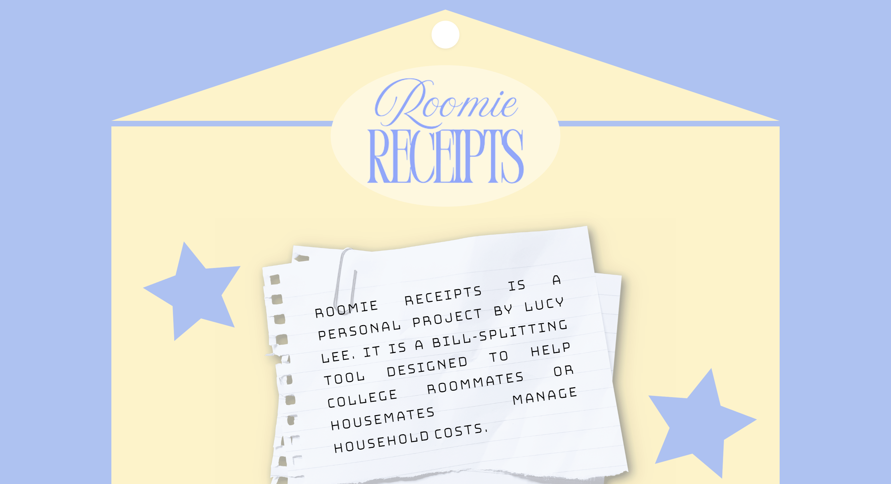
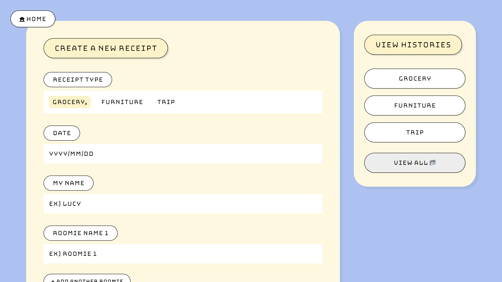
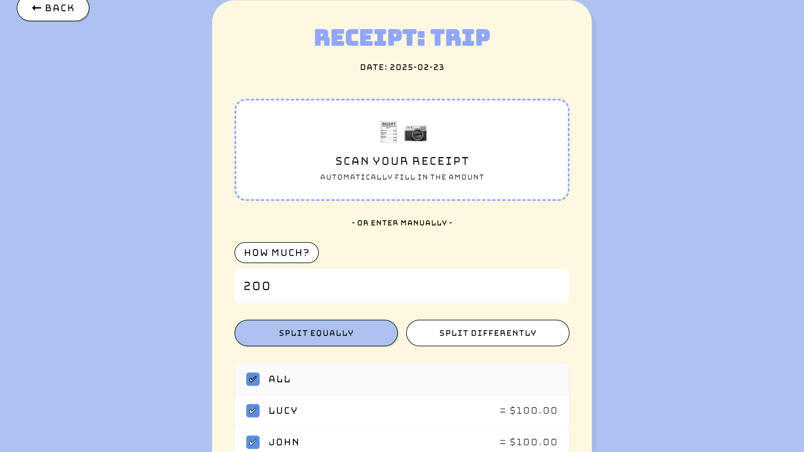
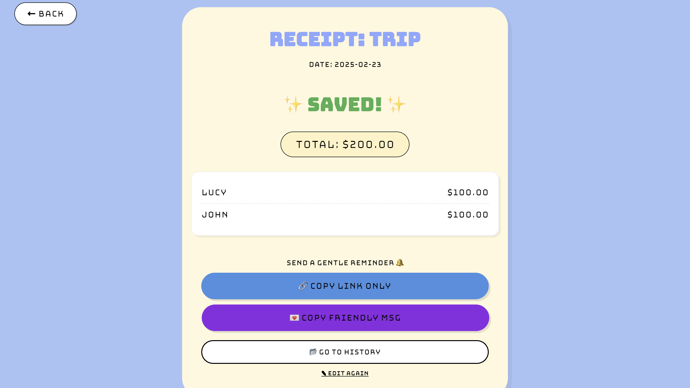
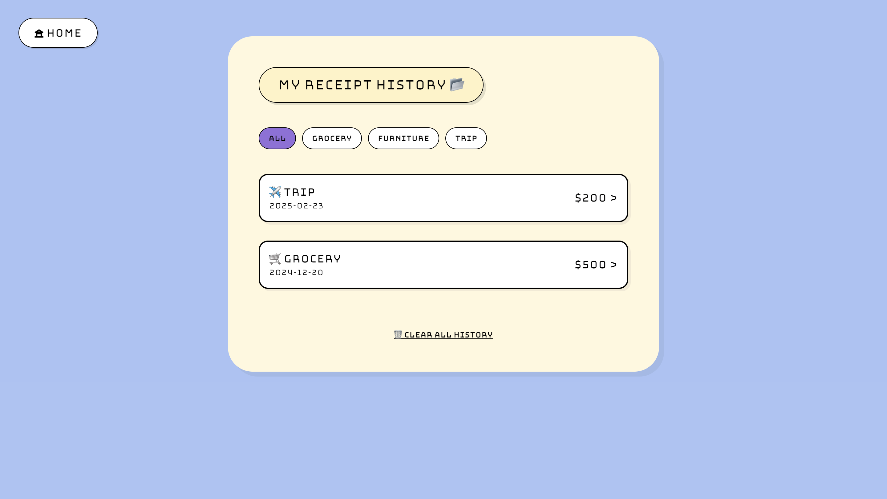

# 🧾 Roomie Receipts

> **A stress-free bill-splitting tool for college roommates.**
> "Money talk doesn't have to be awkward!"

**Roomie Receipts** is a web application designed to help roommates or housemates split communal expenses (groceries, furniture, trips) easily and fairly. With a retro cartoon-style UI, it makes the boring task of settling bills fun and automated.

---

## 🌐 Live Demo

👉 **[Try Roomie Receipts Here!](https://roomie-receipts.pages.dev)**
*(여기에 배포한 실제 링크를 넣어주세요!)*

---

## ✨ Key Features

- **🚀 No Login Required**: Just create a room and start splitting immediately. No sign-up hassle.
- **🎨 Retro & Hip Design**: Unique UI featuring 'Bungee' fonts and cartoon-style elements.
- **💸 Smart Splitting**:
  - **Split Equally**: Automatically divides the total by the number of selected people.
  - **Split Differently**: Assign specific amounts to each person. (Auto-fills remaining amount for 2 people!)
- **📂 Local History**: Your created receipts are safely stored in your browser's local storage for privacy.
- **💌 Gentle Reminders**: One-click to copy a friendly, non-awkward payment reminder message.
- **🔗 Easy Sharing**: Share the receipt link instantly with your roomies.

---

## 🛠️ Tech Stack

- **Frontend**: React, Vite
- **Styling**: CSS (Custom Retro Design), Bungee Fonts
- **Backend / Database**: Supabase
- **Libraries**:
  - `react-router-dom` (for navigation)

---

## 📸 Screenshots

| Landing Page | Create Receipt |
|:---:|:---:|
|  |  |

| Split & Detail | Saved Result |
|:---:|:---:|
|  |  |

| Saved Histories |
|:---:|
|  | 

